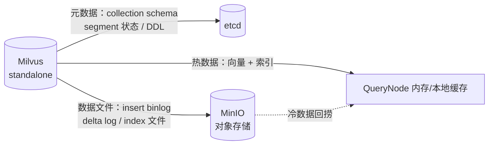

因为 **Milvus 自己就是个「分布式系统的套娃」，它内部必须有一个对象存储**，而它的使用方式和业务侧的文档存储完全不是一个量级/模式，所以官方 compose 直接给它配了一个独立的 MinIO。

## 1. Milvus 的 MinIO 里装的不是「文档」，是它自己的数据文件

Milvus 2.x 把职责拆成了三块：



| 组件 | 存什么 | 特点 |
|---|---|---|
| etcd | 集合 Schema、segment 元信息、DDL | 小、强一致、必须可靠 |
| **MinIO（对象存储）** | **insert binlog（原始向量/标量列存）、delta log（删除标记）、HNSW/IVF 索引文件、stats log** | **大、写多、碎片多** |
| QueryNode 内存 | 常驻索引与热数据 | 宕机后从 MinIO 恢复 |

也就是说：**Milvus 的向量数据最终就落在 MinIO 里**。没有它，Milvus standalone 起不来（会 CrashLoop / `failed to init object storage`）。

## 2. 为什么不复用业务那个 MinIO / SeaweedFS

对应到你的 compose，`milvus-minio` 那几行：

```97:104:e:/Workspace/nexus-agent/backend/deployments/docker-compose.yaml
  milvus-minio: # Milvus 专用 MinIO（与业务 MinIO 隔离）
    image: quay.io/minio/minio:RELEASE.2025-04-22T22-12-26Z
    profiles: [full, obs]
    command: minio server /data
    environment:
      MINIO_ROOT_USER: minioadmin
      MINIO_ROOT_PASSWORD: minioadmin
    volumes: [milvusminiodata:/data]
```

```86:95:e:/Workspace/nexus-agent/backend/deployments/docker-compose.yaml
  milvus:
    image: milvusdb/milvus:v2.5.6
    profiles: [full, obs]
    command: ["milvus", "run", "standalone"]
    environment:
      ETCD_ENDPOINTS: etcd:2379
      MINIO_ADDRESS: milvus-minio:9000
```

隔离的理由，按「真会踩坑」排序：

1. **IO 模式冲突（最关键）**：Milvus 的 flush / compaction 会**持续、突发地**写大量小对象（binlog 段），还要频繁删旧段。这股 IO 压力如果和业务文档上传/下载挤在同一个存储上，SeaweedFS/MinIO 的延迟会互相拖累——你这边还在跑 ETL 解析，那边 compaction 一打满，检索就慢了。

2. **容量与生命周期没法一起管**：Milvus 的数据会随 compaction 反复膨胀再回收，属于「可重建」数据（删了重跑 embedding 就行）；业务文档桶是**唯一原文来源，删了就真没了**。混在一个桶里，一次误操作 / 一条 lifecycle 规则就能把原文带走。

3. **凭证与权限隔离**：Milvus 需要 `minioadmin/minioadmin` 这种全权限账号（它要自己建桶、删对象）。业务侧凭证是给应用用的，权限应该收窄。共用意味着给 Milvus 一把能删文档的钥匙。

4. **版本解耦**：Milvus 2.5.6 对 MinIO 的 S3 API 行为有隐含依赖（官方 compose 锁死了 `RELEASE.2025-04-22T22-12-26Z`）。你想升级/更换业务对象存储（比如从 MinIO 换到 SeaweedFS，就像现在这样）时，不该被 Milvus 绑架。

5. **故障域隔离**：Milvus 那套挂了（etcd 数据损坏、MinIO 卷满）不应该影响知识库上传；反之业务桶出问题也不该让向量库跟着崩。

6. **端口不冲突**：注意 `milvus-minio` **没有 `ports` 映射**，它只在 compose 内部网络里以 `milvus-minio:9000` 暴露——所以不会和宿主上 `127.0.0.1:9000` 的 SeaweedFS 打架。这点已经处理好了。

## 3. 生产环境的做法

- **最小改造**：至少要给 Milvus 一个**独立 bucket + 独立 AK/SK**（或独立前缀 + 独立 lifecycle 规则），不要和业务数据共桶。
- **标准做法**：Milvus standalone 换成外部 etcd + 外部 S3/OSS/GCS（`MINIO_ADDRESS` 改成你的对象存储地址，配 `MINIO_ACCESS_KEY`/`MINIO_SECRET_KEY` / `MINIO_BUCKET_NAME`）。
- **开发机**：就像现在这样 —— 单独跑一个 Milvus 专用 MinIO，反正是数据卷，随手删。

## 4. 对你当前这套配置的影响

你现在 `vector.driver: qdrant`、`milvus.mode: off`，而 Milvus 三件套（etcd / milvus / milvus-minio）都挂在 `profiles: [full, obs]`：

- `make compose-core`（`--profile core`）**不会**启动它们，占不到资源，可以放心留着不动；
- **Qdrant 不需要对象存储**，它的向量和 payload 全在本地卷 `qdrant_storage`（compose 第 73~74 行）里。这也是从 Milvus 切到 Qdrant 后省掉的最大的一块内存/磁盘开销；
- 哪天想回 Milvus 做对比实验，再 `docker compose --profile full up -d` 即可，`milvus-minio` 会自己带起来。